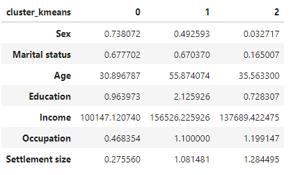
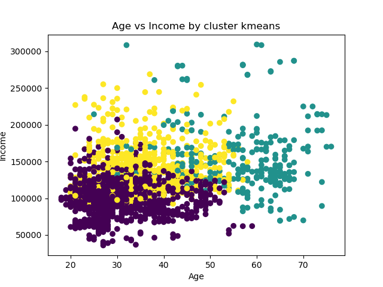
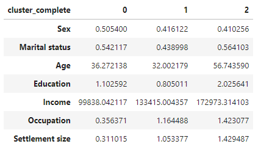
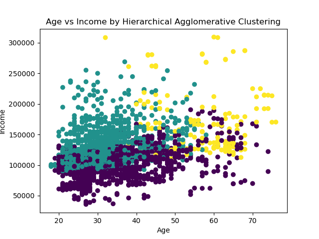

# Clusterização de clientes utilizando Hierarchical Agglomerative Clustering e Kmeans

A análise de clusterização se configura como uma ferramenta poderosa para a segmentação estratégica de clientes, permitindo o agrupamento de indivíduos com base em suas características principais. Essa técnica possibilita às empresas uma compreensão mais profunda do perfil de seus consumidores, abrindo caminho para a oferta direcionada de produtos e serviços que atendam às necessidades e expectativas específicas de cada grupo segmentado.

Ao implementar uma estratégia de segmentação de clientes baseada em análise de clusterização, as empresas podem alcançar um nível mais elevado de personalização, fidelizar seus clientes e alcançar um crescimento sustentável no longo prazo.

fonte dos dados: https://www.kaggle.com/datasets/dev0914sharma/customer-clustering/download?datasetVersionNumber=1

**Dicionário dos dados:**
1. **ID (Customer ID)**:
   A variável ID representa o identificador único de cada cliente.

2. **Sexo (Gender)**:
   0: Masculino
   1: Feminino

3. **Estado Civil (Marital Status)**:
   0: Solteiro
   1: Casado/Divorciado/Viúvo

4. **Idade (Age)**:
   A variável Idade representa a idade do cliente em anos.

5. **Escolaridade (Education Level)**:
   0: Sem escolaridade
   1: Ensino médio
   2: Ensino superior
   4: Pós-graduação

7. **Renda (Income)**:
   A variável Renda representa a renda anual do cliente em dólares.

8. **Ocupação (Occupation)**:
   0: Desempregado/Não Qualificado
   1: Funcionário Qualificado/Oficial
   2: Gerencial/Autônomo/Altamente Qualificado/Oficial

9. **Tamanho da cidade do cliente (Settlement size)**:
   0: cidade pequena
   1: cidade de médio porte
   2: cidade de grande porte

## **Etapas do Projeto**
1. Carregamento dos dados;
2. Tratamento dos dados;
3. Estatísticas descritivas;
4. Identificação da quantidade de clusters Kmeans;
5. Identificação dos clusters Kmeans
6. Resultados clusters Kmeans;
7. Identificação dos clusters com o método Hierarchical Agglomerative Clustering;
8. Resultados Hierarchical Agglomerative Clustering.

## Resultados

**K-Means**
- **Cluster 0**: Mulheres jovens, predominantemente solteiras, com ensino médio, renda mediana, e ocupação menos qualificada em cidades pequenas.
- **Cluster 1**: Equilíbrio de gênero, idade avançada, casados, alta escolaridade, alta renda, ocupações mais qualificadas em cidades de médio porte.
- **Cluster 2**: Predominância de homens jovens, solteiros, menor escolaridade, alta renda, ocupações mais qualificadas em cidades grandes.

**Hierarchical Agglomerative Clustering**
- **Cluster 0**: Grupo misto em termos de gênero e estado civil, idade mediana, ensino médio, renda mediana, ocupação menos qualificada em cidades pequenas.
- **Cluster 1**: Predominância de homens mais jovens, com ensino médio e alta renda, ocupações mais qualificadas em cidades de médio porte.
- **Cluster 2**: Grupo mais velho, alta escolaridade, renda muito alta, ocupações altamente qualificadas em cidades grandes.

